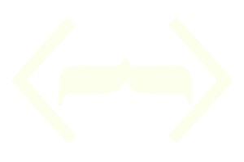

# Coding Mustache

 

##  👤 <strong> About Me </strong>

👋 Hi, My Name is Jorge Carvajal

💻 I am a fullstack developer

📚 Currently learning Swift

⬆️ Top 3% on CodeWars

 
 
  
##  🧰 <strong> ToolBox  </strong>
<!--lang -->

 

 

 

 

<!--JS -->

 
 

<!---DB-->

<!---software-->

 
 
 

<!--Style-->

 

<!--Other-->

 

  
 

